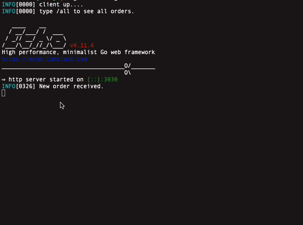

# A simple to-do list application with echo, redis and docker 

## This project constists of client side and server side. Server accepts "orders" to complete. It verifies everything and then passes them to client side 
## Client has an ability to close given orders i.e complete them by interacting with terminal and give information through `stdin`
### Type `/all` to see all orders
### Type `/done` to mark order as completed and delete it
## How to use 
Send a `POST` request to `localhost:8080/new-order` with json body like this `{"order-id":"1","order-desc":"burger"}`. 

This creates a new instance in `redis` database which runs in container and then passes it to client side.

When using `client` container in interactive mode, just type `/all` to see all active orders or `/done` to close any order you've done.

